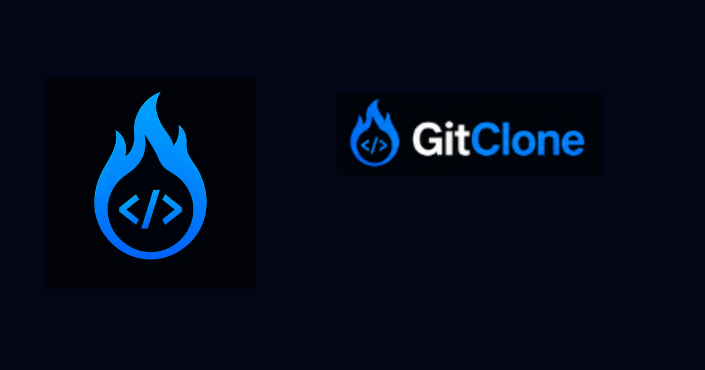
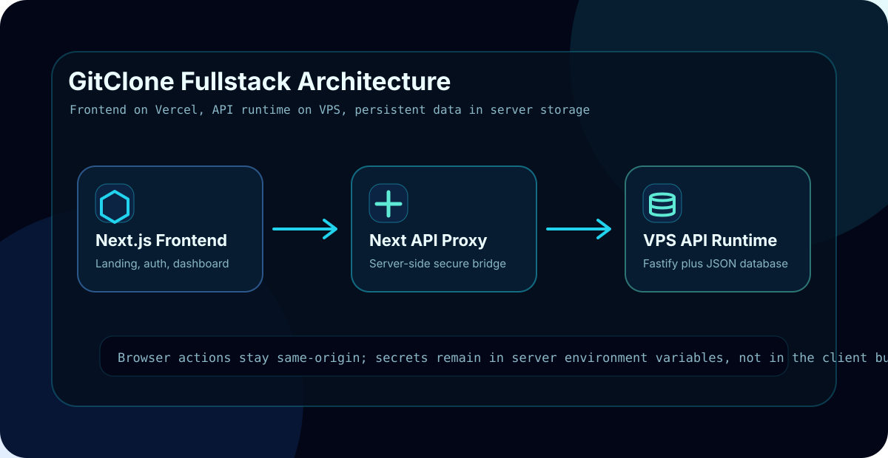
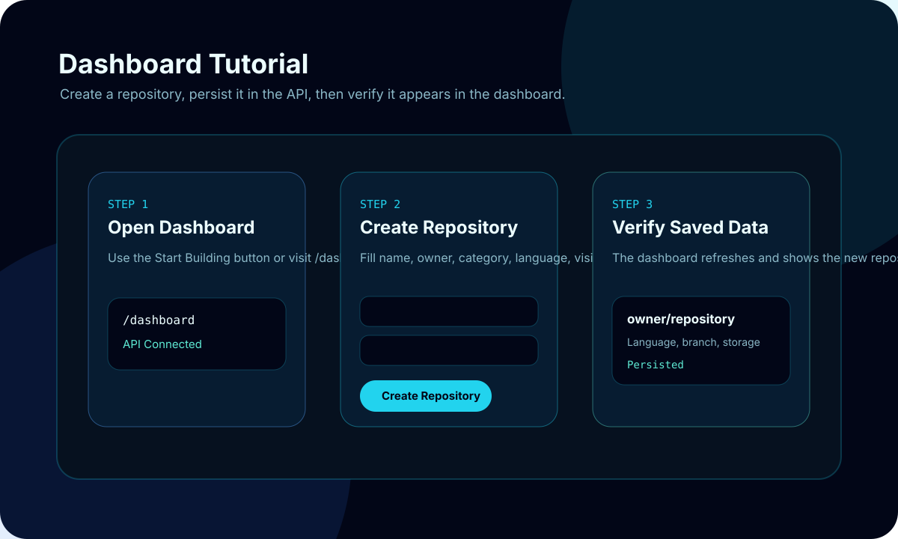
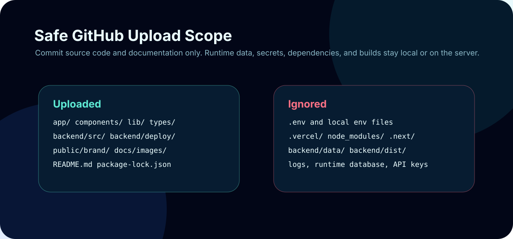

# GitClone

GitClone is a premium futuristic developer platform built with Next.js App Router, TypeScript, TailwindCSS, Framer Motion, and a separate Fastify backend API. It presents an original dark-mode brand identity for repository management, collaboration, issue tracking, branch previews, and deployment workflows.



## Features

- Modern 2026 SaaS/developer UI with dark mode first styling
- Fully responsive layout for mobile, tablet, and desktop
- Framer Motion page transitions, animated cards, particles, and hover effects
- Reusable layout, section, and UI component architecture
- Custom GitClone brand assets in SVG and generated PNG formats
- Premium dashboard, repository explorer, pricing, and testimonial sections
- Fullstack `/dashboard` connected to a backend API
- Persistent backend records for repositories, issues, pull requests, and deployments
- Authentication routes for register, login, logout, and current user session
- Same-origin Next.js API proxy for safe frontend-to-backend writes
- SEO metadata, Open Graph image, favicon, and Vercel-ready configuration

## Tutorial Visuals

### Fullstack Architecture



GitClone is split into three practical layers:

1. The Next.js frontend runs the landing page, login/register screens, docs, dashboard, and Vercel server routes.
2. The Next.js API proxy keeps browser requests same-origin and forwards server-side requests to the backend API.
3. The Fastify backend runs on a VPS and stores repositories, users, sessions, issues, pull requests, and deployments in a persistent JSON database file.

### Dashboard Workflow



The dashboard flow is:

1. Open `/dashboard`.
2. Confirm the API status shows connected.
3. Create a repository from the form.
4. The request is sent through `/api/repositories`.
5. The backend saves the repository and creates the default branch.
6. The dashboard refreshes and shows the saved repository.

### Safe Upload Scope



The repository is designed so only reusable project files are committed. Runtime-only and sensitive files stay ignored by Git.

## Folder Structure

```txt
app/
  api/
  dashboard/
  docs/
  login/
  register/
backend/
  deploy/
  src/
  data/
components/
  layout/
  sections/
  ui/
hooks/
lib/
public/
  brand/
  icons/
docs/
  images/
scripts/
styles/
types/
```

## Installation

```bash
npm install
npm run backend:install
npm run assets
```

## Local Development

Start the backend API:

```bash
npm run backend:dev
```

Start the frontend in another terminal:

```bash
npm run dev
```

Open `http://localhost:3000` in your browser.

Backend API runs on `http://localhost:4000` by default.

## Local Fullstack Test

After both servers are running:

```bash
curl http://localhost:4000/health
curl http://localhost:4000/api/stats
curl http://localhost:3000/api/repositories
```

Then open:

```txt
http://localhost:3000/dashboard
```

Create a repository from the dashboard form. If the backend is running, the new repository will persist in `backend/data/gitclone.db.json`.

## Authentication

GitClone includes a simple server-side auth flow for local/product scaffolding:

- `POST /api/auth/register`
- `POST /api/auth/login`
- `POST /api/auth/logout`
- `GET /api/auth/me`

Passwords are salted and hashed in the backend before storage. For a larger production system, replace the JSON database with PostgreSQL and add email verification, password reset, organization invites, and role-based access control.

## Backend API

Important endpoints:

```txt
GET  /health
GET  /api/stats
GET  /api/repositories
POST /api/repositories
GET  /api/repositories/:id
GET  /api/repositories/:repositoryId/issues
POST /api/issues
PATCH /api/issues/:id/status
GET  /api/repositories/:repositoryId/pull-requests
POST /api/pull-requests
PATCH /api/pull-requests/:id/status
GET  /api/repositories/:repositoryId/deployments
POST /api/deployments
PATCH /api/deployments/:id/status
```

Backend environment variables:

```txt
PORT=4000
HOST=0.0.0.0
FRONTEND_ORIGIN=http://localhost:3000,https://gitclone-flame.vercel.app
DATABASE_FILE=./data/gitclone.db.json
API_KEY=
```

Frontend/server environment variables:

```txt
NEXT_PUBLIC_SITE_URL=https://your-frontend-domain.example
NEXT_PUBLIC_API_BASE_URL=http://localhost:4000
GITCLONE_API_BASE_URL=http://localhost:4000
GITCLONE_API_KEY=
```

Use `GITCLONE_API_BASE_URL` and `GITCLONE_API_KEY` on Vercel so server routes can securely call the VPS backend. Do not expose real API keys in `NEXT_PUBLIC_*` variables.

## Production Build

```bash
npm run lint
npm run typecheck
npm run backend:typecheck
npm run backend:build
npm run build
```

## Safe GitHub Upload

These files should be uploaded:

- Application source: `app/`, `components/`, `hooks/`, `lib/`, `styles/`, `types/`
- Backend source: `backend/src/`, `backend/deploy/`, `backend/package.json`, `backend/package-lock.json`, `backend/tsconfig.json`
- Public assets: `public/brand/`, `public/icons/`, `docs/images/`
- Project config and docs: `README.md`, `package.json`, `package-lock.json`, `tsconfig.json`, `next.config.ts`, `vercel.json`, `env.example`

These files must stay ignored:

- `.env`, `.env*.local`
- `.vercel/`
- `node_modules/`, `backend/node_modules/`
- `.next/`, `out/`, `build/`
- `backend/data/`, `backend/dist/`
- logs, temporary files, runtime database files, API keys, and deployment archives

## Vercel Deployment

1. Push the repository to GitHub.
2. Import the repository in Vercel.
3. Keep the framework preset as `Next.js`.
4. Set `NEXT_PUBLIC_SITE_URL` to your production domain.
5. Set `GITCLONE_API_BASE_URL` to your VPS backend URL.
6. Set `GITCLONE_API_KEY` to the same API key configured on the backend.
7. Deploy.

Vercel will run `npm install` and `npm run build` automatically.

## VPS Backend

Recommended backend runtime:

```bash
cd backend
npm ci
npm run build
PORT=4000 HOST=0.0.0.0 FRONTEND_ORIGIN=https://YOUR-VERCEL-DOMAIN API_KEY=CHANGE_ME npm run start
```

For 24/7 runtime, run the compiled backend with `systemd` or PM2 behind Nginx/Caddy.

Example systemd unit is included at:

```txt
backend/deploy/gitclone-api.service
```

## GitHub Upload Instructions

```bash
git init
git add .
git commit -m "Initial commit: GitClone website"
git branch -M main
git remote add origin https://github.com/USERNAME/gitclone.git
git push -u origin main
```

## Brand Assets

Editable SVG masters and generated PNG exports live in `public/brand`.

Required generated files:

- `public/brand/logo-full.png`
- `public/brand/logo-symbol.png`
- `public/brand/favicon.png`
- `public/brand/icon-repo.png`
- `public/brand/icon-branch.png`
- `public/brand/icon-commit.png`
- `public/brand/icon-pull-request.png`

Regenerate assets after editing SVG masters:

```bash
npm run assets
```
